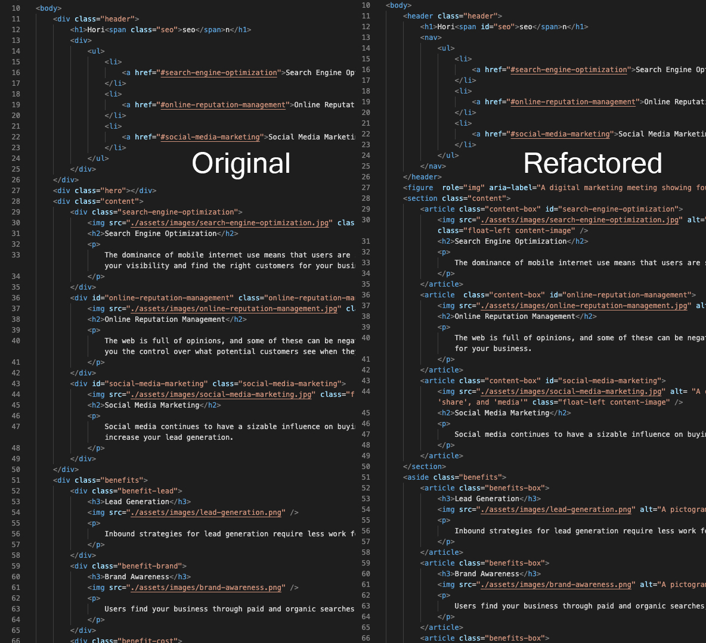
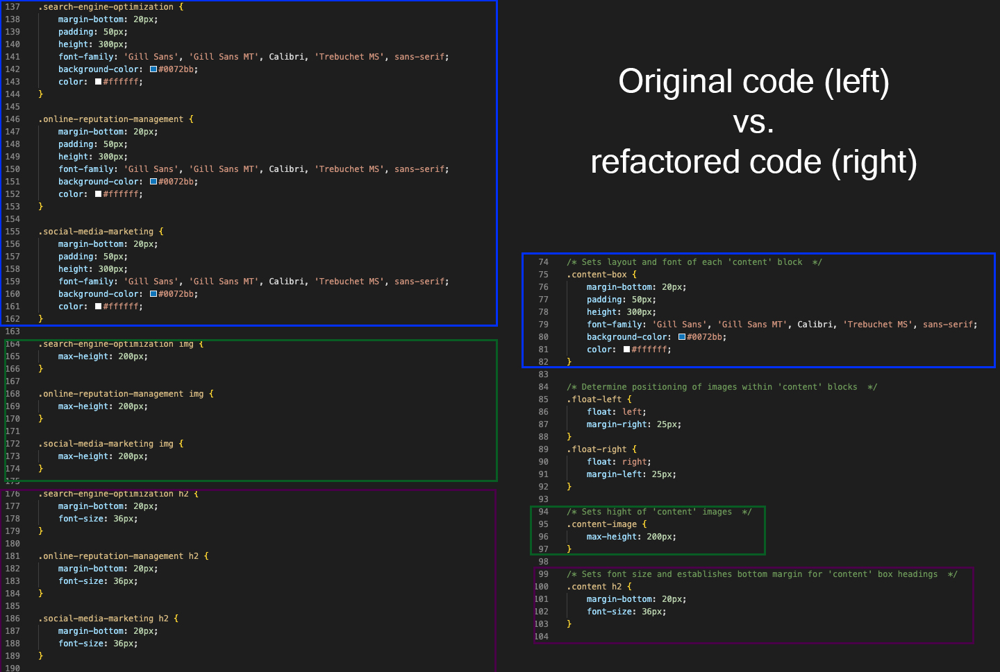

# horiseon-code-refactor
## Description
The purpose of this refactor was to improve accessibility and clean up the CSS code for future use and efficiency. To improve the accesibility of the HTML file all `div` tags were updated to relevant semantic tags and alt text was added to all `img` tags. The main issue remaining in this process is the digital-marketing-meeting.png which appears large at the top of the page which is included with a CSS background property instead of an HTML `img` tag. Though accessibility standards would prefer this image be reworked into the HTML, that falls outside of the scope of this refactor, so it has been left as is with the addition of an `role` and `aria-label` in the HTML.

In order to simplify and increase the efficiency of the CSS several cases of multiple classes containing redundant code were condensed. Once condensed the selectors were reorganized in order to follow the semantic structure of the HTML. In addition comments have been added to all CSS selectors for ease of future use. 

## Installation
N/A
## Usage

Deployed website can be viewed [here.](https://github.com)

## Credits
N/A
## License
Please refer to the LICENSE in the repo.